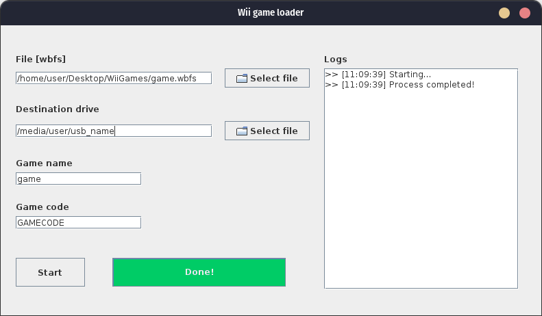

# Wii Game Loader 👾

This program allows users to load Wii games onto a USB stick for playing on the Wii console. It's developed in Java with a Swing graphical user interface.

## Usage 💪

To use this program, follow these steps:

1. Ensure that you have [Java](https://www.java.com) installed on your system;
2. Download the executable file `Wii-game-loader v1.0.jar` or `Wii-game-loader v1.0.exe` from the Release section of this repository;
3. Run the downloaded file;
4. Connect the USB stick and follow the on-screen instructions to load games onto it;
5. Play game.

## Example 🎮

